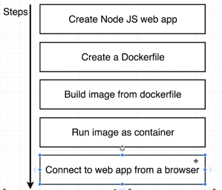
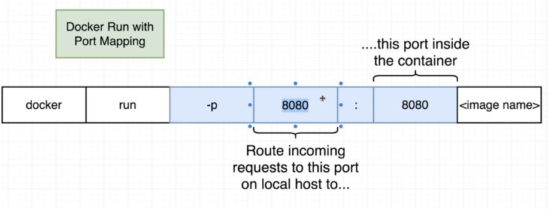

# Docker Node Project

#### Project Flow


#### Docker run with port mapping
```
sudo docker run -p 8080:8080 <image id | image name> 
```
- 

#### Avoid copying files to the root directory (add to the dockerfile)
- `WORKDIR /usr/app` (before `COPY`)
